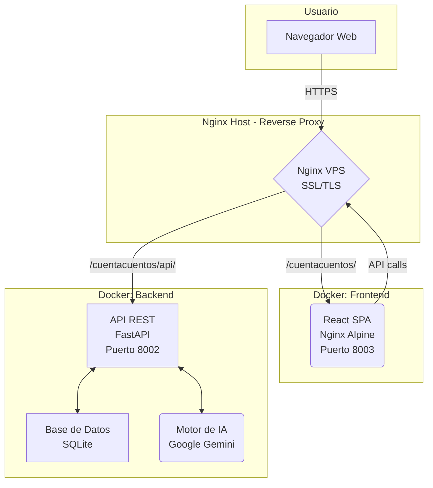
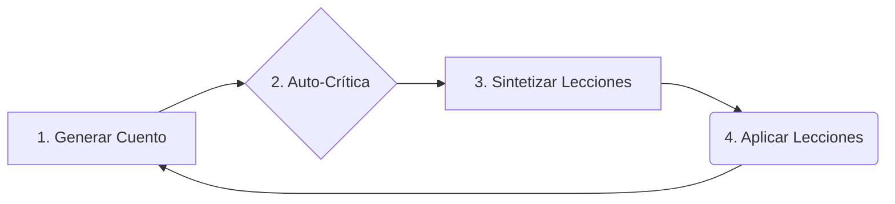
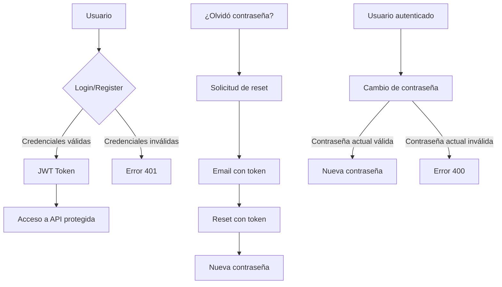

# 🏗️ Arquitectura del Sistema

Este documento describe la arquitectura técnica del proyecto CuentaCuentos AI, un sistema API-first diseñado para la generación y mejora continua de cuentos infantiles.

## 🚀 Arquitectura General

El proyecto sigue un patrón **API-first**, separando completamente el backend (lógica de negocio e IA) del frontend (interfaz de usuario).



- **Frontend:** SPA React 19 + Vite 6, servida por un contenedor Docker con Nginx Alpine. El build de producción se genera con multi-stage Docker (Node → Nginx). React Router maneja las rutas del cliente.
- **Backend:** Aplicación FastAPI en contenedor Docker. Contiene toda la lógica de negocio, la interacción con la base de datos y la comunicación con la IA de Google Gemini.
- **Nginx Host:** Actúa como reverse proxy, enruta `/cuentacuentos/` al contenedor frontend (puerto 8003) y `/cuentacuentos/api/` al contenedor backend (puerto 8002). Gestiona SSL/TLS con Let's Encrypt.

### Tecnologías Clave
- **Framework Backend:** FastAPI (Python 3.11)
- **Motor de IA:** Google Gemini (gemini-2.5-flash)
- **Base de Datos:** SQLite (desarrollo y producción), con opción a PostgreSQL + pgvector.
- **Frontend:** React 19 + Vite 6 (SPA con React Router)
- **Contenedores:** Docker + Docker Compose (backend y frontend)
- **Servidor Web:** Nginx (host como reverse proxy + contenedor frontend)
- **SSL:** Let's Encrypt (automático)

---

## 🔄 El Corazón del Sistema: El Bucle de Aprendizaje Evolutivo

La característica más importante de esta arquitectura es su capacidad de auto-mejora. Esto se logra a través de un ciclo continuo de cuatro pasos: **Generar, Criticar, Sintetizar y Aplicar**.



1.  **Generar Cuento:** Se genera un nuevo cuento utilizando el motor de IA, basado en un prompt que incluye la guía de estilo actual y las lecciones aprendidas. Para mejorar la calidad, se utiliza un sistema **RAG (Retrieval-Augmented Generation)** que busca ejemplos de cuentos exitosos en la base de datos y los añade al prompt.

2.  **Auto-Crítica (en background):** Inmediatamente después de guardar el cuento, una tarea en segundo plano envía ese mismo cuento a la IA, pero esta vez con un prompt que le pide actuar como un "editor exigente". La IA devuelve una crítica estructurada con puntos fuertes, débiles y un score numérico, que se guarda en la base de datos.

3.  **Sintetizar Lecciones:** Cada vez que se acumula un número determinado de críticas (ej. cada 2), un proceso automático se activa. Envía el lote de críticas a la IA y le pide que identifique **patrones y meta-lecciones**. Por ejemplo, si varias críticas mencionan que "los finales son muy abruptos", el sistema sintetiza una lección como: "Mejorar la cadencia y el cierre de los cuentos".

4.  **Aplicar Lecciones:** Las lecciones sintetizadas se guardan en un archivo de configuración (`learning_history.json`). La próxima vez que se vaya a generar un cuento, el `prompt_service` carga estas lecciones activas y las inyecta en el prompt, influyendo en el estilo y la estructura de la nueva creación.

Este ciclo convierte al sistema en un **motor evolutivo** que no solo genera contenido, sino que aprende de su propio trabajo para mejorar la calidad con el tiempo.

---

## 📁 Estructura del Proyecto

```
CuentaCuentos/
├── backend/                   # 🔧 API REST con FastAPI
│   ├── main.py                # Aplicación FastAPI principal
│   ├── config.py              # Configuración centralizada
│   ├── .env.example           # Plantilla de variables de entorno
│   ├── requirements.txt       # Dependencias Python
│   ├── data/                  # Archivos de datos, BD SQLite y audio
│   ├── models/                # Capa de datos (SQLAlchemy, Pydantic)
│   ├── services/              # Lógica de negocio
│   ├── routers/               # Endpoints API
│   └── .venv/                 # Entorno virtual
├── frontend/                  # 🎨 Interfaz Web legacy (HTML/CSS/JS estático) [DEPRECATED]
├── frontend-react/            # ⚛️ Interfaz Web moderna (React 19 + Vite 6) [PRODUCCIÓN]
│   ├── Dockerfile             # Multi-stage: Node 20 build → Nginx Alpine serve
│   ├── nginx.conf             # Nginx interno del contenedor (SPA routing, cache)
│   ├── .dockerignore          # Exclusiones para build Docker
│   ├── src/
│   │   ├── api/               # Cliente API centralizado
│   │   ├── components/        # Componentes reutilizables (Layout, Pagination, etc.)
│   │   ├── context/           # React Context (autenticación)
│   │   └── pages/             # Páginas (Login, Register, Profile, Generator, etc.)
│   ├── vite.config.js         # Configuración de Vite (proxy, base URL)
│   └── package.json           # Dependencias Node.js
├── deployment/                # 📦 Configuración de infraestructura
│   ├── nginx_vps.conf         # Config Nginx VPS (frontend estático - legacy)
│   └── nginx_vps_react.conf   # Config Nginx VPS (frontend Docker - ACTUAL)
├── docker-compose.yml         # 🐳 Orquestación: backend + frontend
├── Dockerfile                 # 🐳 Backend (Python/FastAPI)
├── .dockerignore              # Exclusiones para build Docker del backend
├── docs/                      # 📚 Documentación
│   ├── ARCHITECTURE.md        # Este archivo
│   ├── deployment-vps.md      # Guía de despliegue completa
│   └── ...
└── README.md                  # Archivo principal de bienvenida
```

---

## 🛠️ Componentes del Sistema

1.  **The Writer (El Escritor):** El `gemini_service` cuando genera cuentos. Sigue las instrucciones del `prompt_service`.
2.  **The Editor (El Editor):** El `gemini_service` cuando genera críticas. Analiza el texto en busca de mejoras.
3.  **The Archivist (El Archivista):** La capa de base de datos (`database_sqlite.py`) que almacena cuentos, críticas y sus embeddings.
4.  **The Teacher (El Maestro):** El `learning_service` que orquesta la síntesis de lecciones y actualiza el perfil de estilo.
5.  **The Guardian (El Guardián):** El sistema de autenticación (`auth_service`) que protege el acceso con JWT y gestiona sesiones.
6.  **The Messenger (El Mensajero):** El `email_service` que envía notificaciones y emails de recuperación vía Brevo.

---

## 📊 Esquema de Base de Datos (SQLite)

Los modelos de datos son la base para la persistencia y el aprendizaje.

```python
# Modelos definidos en backend/models/database_sqlite.py

# Almacena cada cuento generado.
class Story(Base):
    id: str  # UUID
    title: str
    content: str
    embedding_json: list  # Vector de embedding para búsqueda semántica (RAG)
    ...

# Almacena la evaluación de cada cuento.
class Critique(Base):
    id: str
    story_id: str
    critique_text: str  # El JSON completo de la crítica
    score: int          # El score numérico (1-10) extraído del JSON
    ...
```
*(Se omiten otros modelos como `Lesson` y `Character` por brevedad).*

---
---

## ⚙️ Implementación Detallada del Bucle de Aprendizaje

El sistema de aprendizaje evolutivo está **100% funcional** y se compone de los siguientes elementos:

### 1. Servicios Creados

#### **`services/gemini_service.py`**
- ✅ Función `synthesize_lessons()` añadida
- Analiza lote de críticas y extrae patrones usando Gemini
- Genera lecciones accionables en formato JSON estructurado

#### **`services/learning_service.py`** (NUEVO)
- ✅ Gestión completa del sistema de aprendizaje
- Funciones principales:
  - `load_learning_history()` - Carga lecciones aprendidas
  - `save_learning_history()` - Guarda nuevas lecciones
  - `load_style_profile()` - Carga perfil de estilo
  - `save_style_profile()` - Actualiza perfil evolutivo
  - `add_lessons_to_history()` - Añade lecciones desde síntesis
  - `update_style_profile()` - Aplica ajustes de estilo
  - `get_active_lessons()` - Filtra lecciones activas
  - `get_synthesis_statistics()` - Estadísticas del sistema

### 2. Router de API

#### **`routers/learning.py`** (NUEVO)
Endpoints disponibles:

- **`POST /learning/synthesize?last_n_critiques=5`**
  - Ejecuta síntesis manual de lecciones
  - Analiza las últimas N críticas
  - Actualiza `learning_history.json` y `style_profile.json`
  - Retorna resumen con lecciones aprendidas

- **`GET /learning/statistics`**
  - Estadísticas del sistema de aprendizaje
  - Total de lecciones, lecciones por categoría
  - Promedio de scores recientes
  - Fecha de última síntesis

- **`GET /learning/lessons?category=pacing&status_filter=active`**
  - Lista lecciones aprendidas
  - Filtros: categoría y status

### 3. Integración Automática

#### **`routers/stories.py` - Función `auto_critique_story()`**
- ✅ **Síntesis automática cada 2 críticas**
- Cuando se alcanza el umbral (configurable):
  1. Obtiene las últimas 2 críticas
  2. Ejecuta síntesis con Gemini
  3. Guarda lecciones en `learning_history.json`
  4. Actualiza `style_profile.json`
  5. Logs detallados del proceso

```python
SYNTHESIS_THRESHOLD = 2  # Configurable
```

### 4. Archivos de Datos del Aprendizaje

#### **`data/learning_history.json`**
Almacena todas las lecciones aprendidas:
```json
[
  {
    "lesson_id": 1,
    "origin_critique_ids": ["id1", "id2", ...],
    "insight": "Lección específica aprendida",
    "category": "pacing|language_choice|narrative_structure|...",
    "priority": "high|medium|low",
    "actionable_guidance": "Consejo concreto",
    "supporting_evidence": "Evidencia de las críticas",
    "applied_count": 0,
    "effectiveness_score": null,
    "status": "active",
    "synthesized_at": "2026-02-04"
  }
]
```

#### **`data/style_profile.json`**
Perfil evolutivo que se actualiza automáticamente con cada síntesis:
```json
{
  "evolution_metrics": {
    "last_synthesis": "2026-02-04",
    "lessons_active": 5,
    "total_lessons_learned": 12,
    "avg_effectiveness": 0.875
  },
  "active_learning_focus": [
    "Enfoque más reciente",
    "Enfoque anterior",
    "..."
  ],
  "stylistic_markers": {
    "current_improvement_areas": [...]
  }
}
```

### 5. Flujo Combinado: RAG + Aprendizaje Abstracto

El sistema no solo aprende lecciones abstractas, sino que las combina con ejemplos concretos a través de **Retrieval-Augmented Generation (RAG)**.

```
Usuario genera cuento → 
  → RAG busca ejemplos similares exitosos en la BD
  → Sistema construye prompt con:
    • Reglas de estilo (ej. `LITERARY_QUALITY.md`)
    • Lecciones abstractas aprendidas (de `learning_history.json`)
    • Ejemplos concretos de cuentos similares (vía RAG)
  → Gemini genera cuento mejorado
  → Crítica automática en background
  → Cada N críticas: síntesis automática de nuevas lecciones
  → Ciclo se repite con mejora continua
```

**El sistema ahora aprende tanto de lecciones abstractas como de ejemplos concretos de éxito, creando un ciclo de mejora dual.**

---

## 🔐 Sistema de Autenticación y Seguridad

El sistema incluye un sistema completo de autenticación basado en JWT (JSON Web Tokens) con funcionalidades avanzadas de recuperación de contraseña.

### Arquitectura de Autenticación



### Componentes de Autenticación

#### **1. Modelos de Base de Datos**

**Tabla `users`:**
```python
class User(Base):
    id: int (PK)
    username: str (unique)
    email: str (unique, nullable)
    hashed_password: str
```

**Tabla `password_reset_tokens`:**
```python
class PasswordResetToken(Base):
    id: str (UUID)
    user_id: int (FK -> users.id)
    token: str (unique, indexed)
    expires_at: datetime
    created_at: datetime
    used: bool (default=False)
```

#### **2. Servicios**

**`services/auth_service.py`**
- `verify_password()` - Verifica contraseñas con Bcrypt
- `get_password_hash()` - Hashea contraseñas con Bcrypt
- `create_access_token()` - Genera tokens JWT
- `generate_reset_token()` - Genera tokens seguros (256 bits)
- `create_password_reset_token()` - Crea token en BD
- `validate_reset_token()` - Valida token y expiración
- `reset_password()` - Resetea contraseña con token
- `change_password()` - Cambia contraseña autenticado

**`services/email_service.py`**
- `_send_template_email()` - Función genérica para enviar templates de Brevo
- `send_welcome_email()` - Envía email de bienvenida automático al registrarse
- `send_password_reset_email()` - Envía email con enlace de reset
- `send_password_changed_confirmation()` - Confirma cambio exitoso (usa template Brevo)
- `add_contact_to_list()` - Sincroniza contacto con lista de Brevo
- Integración con Brevo API (300 emails/día en plan gratuito)
- Sistema de templates profesionales configurables desde dashboard de Brevo

#### **3. Endpoints de Autenticación**

**Registro y Login:**
- `POST /users/` - Registrar nuevo usuario (envía email de bienvenida automático)
- `POST /token` - Login (OAuth2 password flow)
- `GET /users/me` - Info del usuario autenticado

**Recuperación de Contraseña:**
- `POST /forgot-password` - Solicitar reset por email
- `POST /reset-password` - Resetear con token
- `POST /change-password` - Cambiar contraseña (requiere auth)

### Flujo de Reset de Contraseña

```
1. Usuario olvida contraseña
   ↓
2. POST /forgot-password {email}
   ↓
3. Backend busca usuario por email
   ↓
4. Genera token seguro (expira en 1h)
   ↓
5. Guarda token en BD
   ↓
6. Envía email con enlace: /reset-password?token=xxx
   ↓
7. Usuario hace click en enlace
   ↓
8. Frontend captura token
   ↓
9. POST /reset-password {token, new_password}
   ↓
10. Backend valida token (no expirado, no usado)
   ↓
11. Actualiza contraseña hasheada
   ↓
12. Marca token como usado
   ↓
13. Envía email de confirmación
```

### Características de Seguridad

**Hashing de Contraseñas:**
- ✅ Bcrypt con coste adaptativo (a través de Passlib)
- ✅ Salt único por contraseña
- ✅ Resistente a ataques de fuerza bruta

**Tokens de Sesión (JWT):**
- ✅ Firmados con SECRET_KEY (HS256)
- ✅ Expiración configurable (30 minutos por defecto)
- ✅ Payload mínimo (solo username)

**Tokens de Reset:**
- ✅ Generados con `secrets.token_urlsafe(32)` (256 bits)
- ✅ Expiración de 1 hora
- ✅ Un solo uso (marcados como usados)
- ✅ Almacenados en texto plano en BD (token opaco, no predecible)
- ✅ Limpieza automática de tokens expirados

**Protección de Información:**
- ✅ Mensajes ambiguos (no revela si email existe)
- ✅ Rate limiting recomendado en producción
- ✅ HTTPS obligatorio en producción
- ✅ Notificaciones por email en cambios de seguridad

### Integración con Brevo (Email Service)

**Configuración:**
```python
BREVO_API_KEY = os.getenv("BREVO_API_KEY")
BREVO_SENDER_EMAIL = os.getenv("BREVO_SENDER_EMAIL")
BREVO_SENDER_NAME = os.getenv("BREVO_SENDER_NAME", "CuentaCuentos")
FRONTEND_URL = os.getenv("FRONTEND_URL", "http://localhost:3000")
```

**API REST:**
- Endpoint: `https://api.brevo.com/v3/smtp/email`
- Autenticación: Header `api-key`
- Formato: JSON con sender, to, subject, htmlContent o templateId

**Templates de Email (Brevo Dashboard):**
- Template de bienvenida (BREVO_WELCOME_TEMPLATE_ID)
- Template de confirmación de cambio de contraseña (BREVO_CHANGEPASS_TEMPLATE_ID)
- Email de reset con enlace único (HTML inline)
- Parámetros dinámicos: `{{ params.USERNAME }}`, `{{ params.FRONTEND_URL }}`, `{{ params.CHANGE_DATE }}`

**Sincronización de Contactos:**
- Alta automática en lista de Brevo al registrarse
- Variable: BREVO_LIST_ID

**Migración Automática de BD:**
- `_run_migrations()` se ejecuta al inicio del servidor
- Detecta columnas faltantes en tablas existentes y las añade
- Evita necesidad de eliminar la BD al actualizar el esquema

### Mejores Prácticas Implementadas

1. **Separación de Responsabilidades:**
   - Modelos (BD) ← schemas (validación) ← servicios (lógica) ← routers (API)

2. **Validación por Capas:**
   - Pydantic valida entrada
   - Servicios validan lógica de negocio
   - BD valida integridad referencial

3. **Gestión de Errores:**
   - HTTPException con códigos apropiados (400, 401, 404)
   - Mensajes descriptivos pero seguros
   - Logging de operaciones críticas

4. **Testing:**
   - Endpoints documentados en Swagger/OpenAPI
   - Ejemplos de uso en documentación
   - Scripts de prueba con curl

### Frontend React Implementado

Todas las interfaces de usuario de autenticación y gestión de contraseñas están implementadas en `frontend-react/`:

1. **Página de Login** (`/login`) ✅
   - Formulario username/password
   - Enlace a "¿Olvidé mi contraseña?"
   - Enlace a registro

2. **Página de Registro** (`/registro`) ✅
   - Formulario username/email(opcional)/password
   - Validación de formato y confirmación de contraseña
   - Email opcional para habilitar recuperación de contraseña

3. **Página "Olvidé mi contraseña"** (`/olvide-contrasena`) ✅
   - Formulario de email
   - Mensaje de confirmación (sin revelar si el email existe)
   - Instrucciones sobre expiración del enlace (1h)

4. **Página de Reset** (`/reset-password?token=...`) ✅
   - Formulario de nueva contraseña con confirmación
   - Indicador visual de fortaleza de contraseña
   - Manejo de token inválido/expirado

5. **Página de Perfil** (`/perfil`) ✅
   - Tarjeta con avatar, username y email
   - Formulario de cambio de contraseña (requiere actual + nueva)
   - Indicador de fortaleza de contraseña
   - Aviso si no tiene email (necesario para recuperación)

Ver documentación completa del frontend: [`frontend-react/README.md`](../frontend-react/README.md)

---