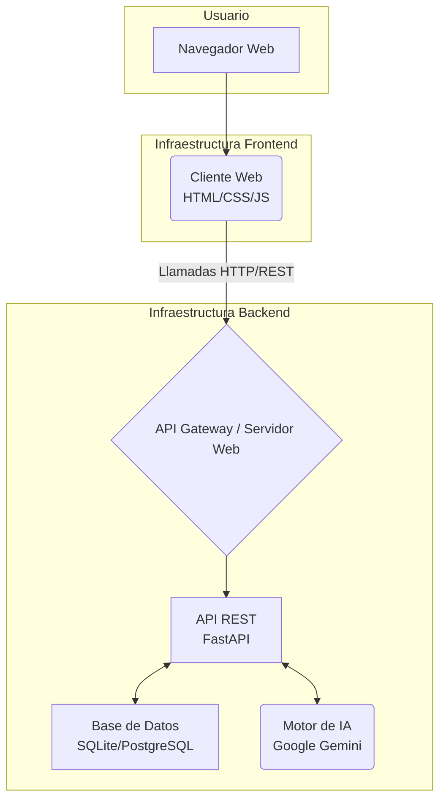
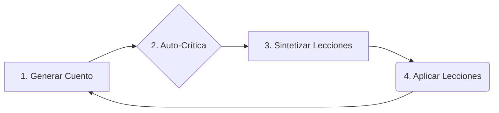

# 🏗️ Arquitectura del Sistema

Este documento describe la arquitectura técnica del proyecto CuentaCuentos AI, un sistema API-first diseñado para la generación y mejora continua de cuentos infantiles.

## 🚀 Arquitectura General

El proyecto sigue un patrón **API-first**, separando completamente el backend (lógica de negocio e IA) del frontend (interfaz de usuario).



- **Frontend:** Un cliente ligero y estático (HTML, CSS, JS) que se comunica con el backend a través de una API REST. No tiene lógica de negocio.
- **Backend:** Una aplicación FastAPI que expone endpoints REST para todas las operaciones. Contiene toda la lógica de negocio, la interacción con la base de datos y la comunicación con la IA de Google Gemini.

### Tecnologías Clave
- **Framework Backend:** FastAPI (Python)
- **Motor de IA:** Google Gemini (gemini-2.5-flash)
- **Base de Datos:** SQLite (desarrollo), con opción a PostgreSQL + pgvector (producción).
- **Frontend:** HTML, CSS, JavaScript (sin frameworks).

---

## 🔄 El Corazón del Sistema: El Bucle de Aprendizaje Evolutivo

La característica más importante de esta arquitectura es su capacidad de auto-mejora. Esto se logra a través de un ciclo continuo de cuatro pasos: **Generar, Criticar, Sintetizar y Aplicar**.



1.  **Generar Cuento:** Se genera un nuevo cuento utilizando el motor de IA, basado en un prompt que incluye la guía de estilo actual y las lecciones aprendidas. Para mejorar la calidad, se utiliza un sistema **RAG (Retrieval-Augmented Generation)** que busca ejemplos de cuentos exitosos en la base de datos y los añade al prompt.

2.  **Auto-Crítica (en background):** Inmediatamente después de guardar el cuento, una tarea en segundo plano envía ese mismo cuento a la IA, pero esta vez con un prompt que le pide actuar como un "editor exigente". La IA devuelve una crítica estructurada con puntos fuertes, débiles y un score numérico, que se guarda en la base de datos.

3.  **Sintetizar Lecciones:** Cada vez que se acumula un número determinado de críticas (ej. cada 2), un proceso automático se activa. Envía el lote de críticas a la IA y le pide que identifique **patrones y meta-lecciones**. Por ejemplo, si varias críticas mencionan que "los finales son muy abruptos", el sistema sintetiza una lección como: "Mejorar la cadencia y el cierre de los cuentos".

4.  **Aplicar Lecciones:** Las lecciones sintetizadas se guardan en un archivo de configuración (`learning_history.json`). La próxima vez que se vaya a generar un cuento, el `prompt_service` carga estas lecciones activas y las inyecta en el prompt, influyendo en el estilo y la estructura de la nueva creación.

Este ciclo convierte al sistema en un **motor evolutivo** que no solo genera contenido, sino que aprende de su propio trabajo para mejorar la calidad con el tiempo.

---

## 📁 Estructura del Proyecto

```
CuentaCuentos/
├── backend/                   # 🔧 API REST con FastAPI
│   ├── main.py                # Aplicación FastAPI principal
│   ├── config.py              # Configuración centralizada
│   ├── .env.example           # Plantilla de variables de entorno
│   ├── requirements.txt       # Dependencias Python
│   ├── data/                  # Archivos de datos y configuración
│   ├── models/                # Capa de datos (SQLAlchemy, Pydantic)
│   ├── services/              # Lógica de negocio
│   ├── routers/               # Endpoints API
│   └── .venv/                 # Entorno virtual
├── frontend/                  # 🎨 Interfaz Web (cliente estático)
│   ├── index.html             # Página de generación
│   ├── cuentos.html           # Biblioteca de cuentos
│   ├── aprendizaje.html       # Dashboard del bucle de aprendizaje
│   ├── css/
│   └── js/
├── docs/                      # 📚 Documentación
│   ├── ARCHITECTURE.md        # Este archivo
│   ├── LITERARY_QUALITY.md    # Guía de estilo literario
│   └── ...
└── README.md                  # Archivo principal de bienvenida
```

---

## 🛠️ Componentes del Sistema

1.  **The Writer (El Escritor):** El `gemini_service` cuando genera cuentos. Sigue las instrucciones del `prompt_service`.
2.  **The Editor (El Editor):** El `gemini_service` cuando genera críticas. Analiza el texto en busca de mejoras.
3.  **The Archivist (El Archivista):** La capa de base de datos (`database_sqlite.py`) que almacena cuentos, críticas y sus embeddings.
4.  **The Teacher (El Maestro):** El `learning_service` que orquesta la síntesis de lecciones y actualiza el perfil de estilo.

## 📊 Esquema de Base de Datos (SQLite)

Los modelos de datos son la base para la persistencia y el aprendizaje.

```python
# Modelos definidos en backend/models/database_sqlite.py

# Almacena cada cuento generado.
class Story(Base):
    id: str  # UUID
    title: str
    content: str
    embedding_json: list  # Vector de embedding para búsqueda semántica (RAG)
    ...

# Almacena la evaluación de cada cuento.
class Critique(Base):
    id: str
    story_id: str
    critique_text: str  # El JSON completo de la crítica
    score: int          # El score numérico (1-10) extraído del JSON
    ...
```
*(Se omiten otros modelos como `Lesson` y `Character` por brevedad).*
