# 🏗️ Arquitectura del Sistema

Este documento describe la arquitectura técnica del proyecto CuentaCuentos AI, un sistema API-first diseñado para la generación y mejora continua de cuentos infantiles.

## 🚀 Arquitectura General

El proyecto sigue un patrón **API-first**, separando completamente el backend (lógica de negocio e IA) del frontend (interfaz de usuario).


- **Frontend:** Un cliente ligero y estático (HTML, CSS, JS) que se comunica con el backend a través de una API REST. No tiene lógica de negocio.
- **Backend:** Una aplicación FastAPI que expone endpoints REST para todas las operaciones. Contiene toda la lógica de negocio, la interacción con la base de datos y la comunicación con la IA de Google Gemini.

### Tecnologías Clave
- **Framework Backend:** FastAPI (Python)
- **Motor de IA:** Google Gemini (gemini-2.5-flash)
- **Base de Datos:** SQLite (desarrollo), con opción a PostgreSQL + pgvector (producción).
- **Frontend:** HTML, CSS, JavaScript (sin frameworks).

---

## 🔄 El Corazón del Sistema: El Bucle de Aprendizaje Evolutivo

La característica más importante de esta arquitectura es su capacidad de auto-mejora. Esto se logra a través de un ciclo continuo de cuatro pasos: **Generar, Criticar, Sintetizar y Aplicar**.

```mermaid
graph LR
    A[1. Generar Cuento] --> B{2. Auto-Crítica}
    B --> C[3. Sintetizar Lecciones]
    C --> D(4. Aplicar Lecciones)
    D --> A
```



1.  **Generar Cuento:** Se genera un nuevo cuento utilizando el motor de IA, basado en un prompt que incluye la guía de estilo actual y las lecciones aprendidas. Para mejorar la calidad, se utiliza un sistema **RAG (Retrieval-Augmented Generation)** que busca ejemplos de cuentos exitosos en la base de datos y los añade al prompt.

2.  **Auto-Crítica (en background):** Inmediatamente después de guardar el cuento, una tarea en segundo plano envía ese mismo cuento a la IA, pero esta vez con un prompt que le pide actuar como un "editor exigente". La IA devuelve una crítica estructurada con puntos fuertes, débiles y un score numérico, que se guarda en la base de datos.

3.  **Sintetizar Lecciones:** Cada vez que se acumula un número determinado de críticas (ej. cada 2), un proceso automático se activa. Envía el lote de críticas a la IA y le pide que identifique **patrones y meta-lecciones**. Por ejemplo, si varias críticas mencionan que "los finales son muy abruptos", el sistema sintetiza una lección como: "Mejorar la cadencia y el cierre de los cuentos".

4.  **Aplicar Lecciones:** Las lecciones sintetizadas se guardan en un archivo de configuración (`learning_history.json`). La próxima vez que se vaya a generar un cuento, el `prompt_service` carga estas lecciones activas y las inyecta en el prompt, influyendo en el estilo y la estructura de la nueva creación.

Este ciclo convierte al sistema en un **motor evolutivo** que no solo genera contenido, sino que aprende de su propio trabajo para mejorar la calidad con el tiempo.

---

## 📁 Estructura del Proyecto

```
CuentaCuentos/
├── backend/                   # 🔧 API REST con FastAPI
│   ├── main.py                # Aplicación FastAPI principal
│   ├── config.py              # Configuración centralizada
│   ├── .env.example           # Plantilla de variables de entorno
│   ├── requirements.txt       # Dependencias Python
│   ├── data/                  # Archivos de datos y configuración
│   ├── models/                # Capa de datos (SQLAlchemy, Pydantic)
│   ├── services/              # Lógica de negocio
│   ├── routers/               # Endpoints API
│   └── .venv/                 # Entorno virtual
├── frontend/                  # 🎨 Interfaz Web (cliente estático)
│   ├── index.html             # Página de generación
│   ├── cuentos.html           # Biblioteca de cuentos
│   ├── aprendizaje.html       # Dashboard del bucle de aprendizaje
│   ├── css/
│   └── js/
├── docs/                      # 📚 Documentación
│   ├── ARCHITECTURE.md        # Este archivo
│   ├── LITERARY_QUALITY.md    # Guía de estilo literario
│   └── ...
└── README.md                  # Archivo principal de bienvenida
```

---

## 🛠️ Componentes del Sistema

1.  **The Writer (El Escritor):** El `gemini_service` cuando genera cuentos. Sigue las instrucciones del `prompt_service`.
2.  **The Editor (El Editor):** El `gemini_service` cuando genera críticas. Analiza el texto en busca de mejoras.
3.  **The Archivist (El Archivista):** La capa de base de datos (`database_sqlite.py`) que almacena cuentos, críticas y sus embeddings.
4.  **The Teacher (El Maestro):** El `learning_service` que orquesta la síntesis de lecciones y actualiza el perfil de estilo.

---

## 📊 Esquema de Base de Datos (SQLite)

Los modelos de datos son la base para la persistencia y el aprendizaje.

```python
# Modelos definidos en backend/models/database_sqlite.py

# Almacena cada cuento generado.
class Story(Base):
    id: str  # UUID
    title: str
    content: str
    embedding_json: list  # Vector de embedding para búsqueda semántica (RAG)
    ...

# Almacena la evaluación de cada cuento.
class Critique(Base):
    id: str
    story_id: str
    critique_text: str  # El JSON completo de la crítica
    score: int          # El score numérico (1-10) extraído del JSON
    ...
```
*(Se omiten otros modelos como `Lesson` y `Character` por brevedad).*

---
---

## ⚙️ Implementación Detallada del Bucle de Aprendizaje

El sistema de aprendizaje evolutivo está **100% funcional** y se compone de los siguientes elementos:

### 1. Servicios Creados

#### **`services/gemini_service.py`**
- ✅ Función `synthesize_lessons()` añadida
- Analiza lote de críticas y extrae patrones usando Gemini
- Genera lecciones accionables en formato JSON estructurado

#### **`services/learning_service.py`** (NUEVO)
- ✅ Gestión completa del sistema de aprendizaje
- Funciones principales:
  - `load_learning_history()` - Carga lecciones aprendidas
  - `save_learning_history()` - Guarda nuevas lecciones
  - `load_style_profile()` - Carga perfil de estilo
  - `save_style_profile()` - Actualiza perfil evolutivo
  - `add_lessons_to_history()` - Añade lecciones desde síntesis
  - `update_style_profile()` - Aplica ajustes de estilo
  - `get_active_lessons()` - Filtra lecciones activas
  - `get_synthesis_statistics()` - Estadísticas del sistema

### 2. Router de API

#### **`routers/learning.py`** (NUEVO)
Endpoints disponibles:

- **`POST /learning/synthesize?last_n_critiques=5`**
  - Ejecuta síntesis manual de lecciones
  - Analiza las últimas N críticas
  - Actualiza `learning_history.json` y `style_profile.json`
  - Retorna resumen con lecciones aprendidas

- **`GET /learning/statistics`**
  - Estadísticas del sistema de aprendizaje
  - Total de lecciones, lecciones por categoría
  - Promedio de scores recientes
  - Fecha de última síntesis

- **`GET /learning/lessons?category=pacing&status_filter=active`**
  - Lista lecciones aprendidas
  - Filtros: categoría y status

### 3. Integración Automática

#### **`routers/stories.py` - Función `auto_critique_story()`**
- ✅ **Síntesis automática cada 2 críticas**
- Cuando se alcanza el umbral (configurable):
  1. Obtiene las últimas 2 críticas
  2. Ejecuta síntesis con Gemini
  3. Guarda lecciones en `learning_history.json`
  4. Actualiza `style_profile.json`
  5. Logs detallados del proceso

```python
SYNTHESIS_THRESHOLD = 2  # Configurable
```

### 4. Archivos de Datos del Aprendizaje

#### **`data/learning_history.json`**
Almacena todas las lecciones aprendidas:
```json
[
  {
    "lesson_id": 1,
    "origin_critique_ids": ["id1", "id2", ...],
    "insight": "Lección específica aprendida",
    "category": "pacing|language_choice|narrative_structure|...",
    "priority": "high|medium|low",
    "actionable_guidance": "Consejo concreto",
    "supporting_evidence": "Evidencia de las críticas",
    "applied_count": 0,
    "effectiveness_score": null,
    "status": "active",
    "synthesized_at": "2026-02-04"
  }
]
```

#### **`data/style_profile.json`**
Perfil evolutivo que se actualiza automáticamente con cada síntesis:
```json
{
  "evolution_metrics": {
    "last_synthesis": "2026-02-04",
    "lessons_active": 5,
    "total_lessons_learned": 12,
    "avg_effectiveness": 0.875
  },
  "active_learning_focus": [
    "Enfoque más reciente",
    "Enfoque anterior",
    "..."
  ],
  "stylistic_markers": {
    "current_improvement_areas": [...]
  }
}
```

### 5. Flujo Combinado: RAG + Aprendizaje Abstracto

El sistema no solo aprende lecciones abstractas, sino que las combina con ejemplos concretos a través de **Retrieval-Augmented Generation (RAG)**.

```
Usuario genera cuento → 
  → RAG busca ejemplos similares exitosos en la BD
  → Sistema construye prompt con:
    • Reglas de estilo (ej. `LITERARY_QUALITY.md`)
    • Lecciones abstractas aprendidas (de `learning_history.json`)
    • Ejemplos concretos de cuentos similares (vía RAG)
  → Gemini genera cuento mejorado
  → Crítica automática en background
  → Cada N críticas: síntesis automática de nuevas lecciones
  → Ciclo se repite con mejora continua
```

**El sistema ahora aprende tanto de lecciones abstractas como de ejemplos concretos de éxito, creando un ciclo de mejora dual.**