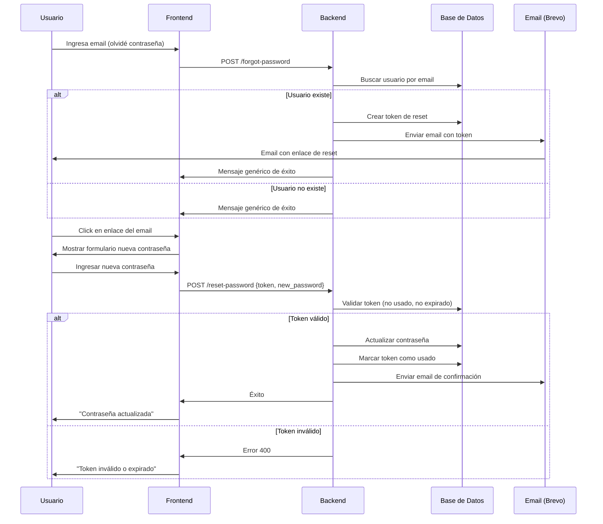

# Configuración de Reset y Cambio de Contraseña

Este documento explica cómo configurar y utilizar el sistema de reset y cambio de contraseñas en CuentaCuentos.

## Características Implementadas

### Backend (✅ Completado)

1. **Base de Datos**
   - Nueva tabla `password_reset_tokens` para almacenar tokens de reset con expiración
   - Campo `email` agregado a la tabla `users`
   - Funciones CRUD para gestionar tokens y usuarios

2. **Servicio de Email con Brevo**
   - Integración completa con Brevo (anteriormente Sendinblue)
   - Templates profesionales configurables desde Brevo dashboard
   - Email de bienvenida automático al registrarse
   - Envío de emails de reset de contraseña con enlace único
   - Emails de confirmación cuando se cambia la contraseña
   - Sincronización automática de contactos con lista de Brevo

3. **Endpoints de Autenticación**
   - `POST /forgot-password` - Solicitar reset de contraseña
   - `POST /reset-password` - Resetear contraseña con token
   - `POST /change-password` - Cambiar contraseña conociendo la actual

4. **Seguridad**
   - Tokens únicos y seguros generados con `secrets.token_urlsafe()`
   - Tokens con expiración de 1 hora
   - Tokens de un solo uso (se marcan como usados)
   - Verificación de contraseña actual antes de cambiar
   - Mensajes genéricos para evitar enumerar usuarios

### Frontend (⏳ Pendiente)

Las siguientes páginas deben ser implementadas:

1. **Página de "Olvidé mi contraseña"**
   - Formulario para ingresar email
   - Llamada a `POST /forgot-password`

2. **Página de Reset de Contraseña**
   - Recibe token por URL (?token=...)
   - Formulario para nueva contraseña
   - Llamada a `POST /reset-password`

3. **Página "Mi Perfil"**
   - Formulario para cambiar contraseña
   - Requiere contraseña actual y nueva contraseña
   - Llamada a `POST /change-password`

## Configuración de Brevo

### 1. Crear una Cuenta en Brevo

1. Visita [https://www.brevo.com](https://www.brevo.com)
2. Crea una cuenta gratuita (incluye 300 emails/día)
3. Verifica tu email

### 2. Obtener API Key

1. Accede a tu cuenta de Brevo
2. Ve a **Settings** → **API Keys**
3. Crea una nueva API Key con permisos de `Send emails`
4. Copia la API Key generada

### 3. Configurar Email Sender

1. Ve a **Settings** → **Senders & IP**
2. Agrega y verifica un email de envío (sender)
3. Este será el email que aparecerá como remitente

### 4. Configurar Templates de Email (Opcional)

Puedes crear templates profesionales en Brevo para emails personalizados:

1. Ve a **Campaigns** → **Email Templates** → **Create Template**
2. Crea los siguientes templates:
   - **Welcome Email**: Email de bienvenida para nuevos usuarios
   - **Password Changed**: Confirmación de cambio de contraseña
3. Anota los IDs de los templates creados

**Variables disponibles en templates:**
- `{{ params.USERNAME }}` - Nombre del usuario
- `{{ params.FRONTEND_URL }}` - URL del frontend
- `{{ params.CHANGE_DATE }}` - Fecha de cambio (solo para password changed)

### 5. Configurar Variables de Entorno

Añade las siguientes variables a tu archivo `.env`:

```env
# Configuración de Brevo
BREVO_API_KEY=xkeysib-tu-api-key-aquí
BREVO_SENDER_EMAIL=noreply@tudominio.com
BREVO_SENDER_NAME=CuentaCuentos

# IDs de Templates (opcional - deja vacío para usar HTML inline)
BREVO_LIST_ID=2  # ID de lista de contactos
BREVO_WELCOME_TEMPLATE_ID=2  # Template de bienvenida
BREVO_CHANGEPASS_TEMPLATE_ID=3  # Template de cambio de contraseña

# URL del Frontend (para enlaces en emails de reset de contraseña)
FRONTEND_URL=http://localhost:3000  # Desarrollo (puerto de Vite)
# FRONTEND_URL=https://elratonsinverguencilla.es/cuentacuentos  # Producción
```

## Uso de los Endpoints

### 1. Solicitar Reset de Contraseña

**Request:**
```http
POST /forgot-password
Content-Type: application/json

{
  "email": "usuario@ejemplo.com"
}
```

**Response:**
```json
{
  "success": true,
  "message": "Si el email está registrado, recibirás un enlace de recuperación en breve"
}
```

**Nota:** Por seguridad, siempre devuelve el mismo mensaje, incluso si el email no existe.

### 2. Resetear Contraseña con Token

**Request:**
```http
POST /reset-password
Content-Type: application/json

{
  "token": "abc123xyz...",
  "new_password": "nuevaContraseña123"
}
```

**Response Exitoso:**
```json
{
  "success": true,
  "message": "Contraseña actualizada exitosamente"
}
```

**Response Error:**
```json
{
  "detail": "Token inválido o expirado"
}
```

### 3. Cambiar Contraseña (Usuario Autenticado)

**Request:**
```http
POST /change-password
Content-Type: application/json
Authorization: Bearer {access_token}

{
  "current_password": "contraseñaActual123",
  "new_password": "nuevaContraseña123"
}
```

**Response Exitoso:**
```json
{
  "success": true,
  "message": "Contraseña cambiada exitosamente"
}
```

**Response Error:**
```json
{
  "detail": "Contraseña actual incorrecta"
}
```

## Flujo de Reset de Contraseña



## Seguridad y Mejores Prácticas

### Implementadas

✅ **Tokens seguros**: Generados con `secrets.token_urlsafe(32)`
✅ **Expiración de tokens**: 1 hora de validez
✅ **Tokens de un solo uso**: Se marcan como usados después de aplicarse
✅ **Hashing de contraseñas**: Bcrypt con Passlib
✅ **Mensajes genéricos**: No revela si un email existe o no
✅ **Validación de contraseña actual**: Para cambios de contraseña
✅ **Emails de confirmación**: Notifica cambios de contraseña

### Recomendaciones Adicionales

🔒 **HTTPS en producción**: Siempre usa HTTPS para proteger credenciales
🔒 **Rate limiting**: Limita intentos de reset por IP
🔒 **Validación de contraseñas**: Implementa requisitos de complejidad
🔒 **2FA opcional**: Considera autenticación de dos factores
🔒 **Logs de seguridad**: Registra intentos de cambio de contraseña
🔒 **Limpieza de tokens**: Elimina tokens expirados periódicamente

## Actualizar Base de Datos

El backend incluye un **sistema de migración automática** que se ejecuta al inicio del servidor. Si la tabla `users` ya existía sin la columna `email`, la columna se añadirá automáticamente.

Si necesitas reinicializar manualmente:

```bash
# Opción 1: Eliminar la base de datos existente (⚠️ perderás todos los datos)
rm cuentacuentos.db

# Opción 2: La migración automática se encarga al reiniciar el servidor
# La función _run_migrations() en database_sqlite.py detecta columnas faltantes
uvicorn main:app --reload
```

## Testing

Puedes probar los endpoints con curl:

```bash
# 1. Solicitar reset
curl -X POST http://localhost:8000/forgot-password \
  -H "Content-Type: application/json" \
  -d '{"email": "test@ejemplo.com"}'

# 2. Resetear contraseña (reemplaza TOKEN con el token del email)
curl -X POST http://localhost:8000/reset-password \
  -H "Content-Type: application/json" \
  -d '{"token": "TOKEN", "new_password": "nueva123"}'

# 3. Cambiar contraseña (reemplaza ACCESS_TOKEN con tu token JWT)
curl -X POST http://localhost:8000/change-password \
  -H "Content-Type: application/json" \
  -H "Authorization: Bearer ACCESS_TOKEN" \
  -d '{"current_password": "actual123", "new_password": "nueva123"}'
```

## Próximos Pasos

### Para Backend

- [ ] Configurar Alembic para migraciones de base de datos
- [ ] Implementar rate limiting en endpoints de auth
- [ ] Agregar validación de complejidad de contraseñas
- [ ] Implementar cleanup automático de tokens expirados (tarea programada)
- [ ] Agregar logs de auditoría para cambios de contraseña

### Para Frontend

- [ ] Crear página "Olvidé mi contraseña" con formulario de email
- [ ] Crear página de reset con formulario de nueva contraseña
- [ ] Crear sección "Mi Perfil" con opción de cambiar contraseña
- [ ] Agregar validación de fortaleza de contraseña
- [ ] Implementar mensajes de error y éxito amigables
- [ ] Agregar indicador de fortaleza de contraseña

## Soporte

Si tienes problemas con la configuración:

1. Verifica que todas las variables de entorno estén configuradas
2. Revisa los logs del servidor para mensajes de error
3. Verifica que la API Key de Brevo sea válida y tenga permisos
4. Asegúrate de que el email sender esté verificado en Brevo

## Referencias

- [Documentación de Brevo API](https://developers.brevo.com/)
- [Brevo Console](https://app.brevo.com/)
- [FastAPI Security](https://fastapi.tiangolo.com/tutorial/security/)
- [Passlib Docs](https://passlib.readthedocs.io/)
